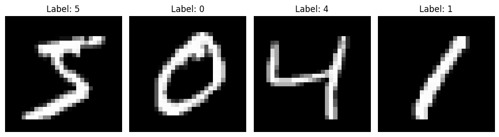

# MNIST Neural Network




## Table of Contents
- [Overview](#overview)
- [Project Structure](#project-structure)
- [Neural Network Structure](#neural-network-structure)
- [Installation & Setup](#installation--setup)
- [Usage](#usage)
- [Results](#results)

## Overview

This repository is an experimental project that demonstrates how a feedforward (fully connected) neural network can be implemented using different programming languages with the MNIST dataset. Currently, the project includes implementations in Rust and Python. The focus is on exploring how neural networks can be designed and constructed in various programming environments. Although the current implementation uses a feedforward approach, the repository is structured with future extensions in mind, making it possible to incorporate multiple neural network algorithms and architectures as the project evolves.

While the MNIST dataset is sometimes viewed as overused, its simplicity and well-known structure make it an ideal starting point for understanding the core mechanics of neural network design and experimentation.

note that both implementations share the same MNIST dataset contained in the `data` folder for consistency.


## Neural Network Structure

The neural network is a feedforward (fully connected) model that processes normalized MNIST images, passes them through multiple hidden layers with non-linear activations, and produces predictions for 10 digit classes.

### Component Overview

| Module/File                         | Description                                                                                                 |
| ----------------------------------- | ----------------------------------------------------------------------------------------------------------- |
| **main (main.rs / main.py)**        | Entry point that initializes the network, loads data, runs the training loop, and prints performance metrics. |
| **activations (activations.rs / activations.py)** | Implements activation functions (e.g., ReLU, Sigmoid) to introduce non-linearity. |
| **dataset (dataset.rs / dataset.py)** | Loads, normalizes, and partitions the MNIST dataset into training and testing sets.                         |
| **layer (layer.rs / layer.py)**       | Defines each network layer's operations including forward propagation and gradient calculations.           |
| **network (network.rs / network.py)** | Assembles the layers into a complete network architecture and manages data flow between layers.              |
| **loss (loss.rs / loss.py)**          | Implements loss functions (e.g., cross-entropy) and calculates gradients for backpropagation.                 |
| **utils (utils.rs / utils.py)**       | Provides utility functions for tasks like parameter initialization and logging.                            |

### Detailed Network Workflow

<details>
<summary>Click to expand for more details</summary>

- **Input Processing:**  
  - The MNIST images are normalized before being fed into the network.

- **Hidden Layers:**  
  - Each layer computes a weighted sum of its inputs, applies an activation function (such as ReLU) to introduce non-linearity, and passes the result to the next layer.

- **Output Layer:**  
  - The final layer produces predictions for 10 classes corresponding to the digits 0–9.

- **Loss Calculation:**  
  - A cross-entropy loss function evaluates the difference between the predicted outputs and the actual labels.

- **Backpropagation:**  
  - Gradients are computed from the loss, allowing for weight updates during training.
  
</details>

### Data Flow Diagram

```mermaid
flowchart TD
    A[Input Layer (Normalized MNIST Image)]
    B[Hidden Layer 1]
    C[Activation (ReLU)]
    D[Hidden Layer 2]
    E[Activation (ReLU)]
    F[Output Layer (10 Neurons)]
    G[Loss Calculation (Cross-Entropy)]
    
    A --> B
    B --> C
    C --> D
    D --> E
    E --> F
    F --> G
```
## Installation & Setup

### For Rust

1. **Prerequisites:**
   - Install the Rust toolchain (latest stable version) from [rust-lang.org](https://www.rust-lang.org/tools/install).

2. **Build & Run:**

   **Debug Mode:**
   ```bash
   cd rust_feedforward
   cargo run
   ```

   **Release Mode (Optimized):**
   ```bash
   cd rust_feedforward
   cargo run --release
   ```

3. **Data Setup:**
   - Ensure the `data` folder is located at the root level of the repository.
   - The Rust code will automatically download the MNIST data into this folder if it is not already present.

---

### For Python

1. **Prerequisites:**
   - Python 3.8+ (or your preferred version)
   - A virtual environment tool (optional but recommended)

2. **Setting Up the Virtual Environment:**
   ```bash
   cd python_feedforward
   python -m venv venv
   source venv/bin/activate   # On Windows, use: venv\Scripts\activate
   ```

3. **Install Dependencies:**
   ```bash
   pip install -r requirements.txt
   ```

4. **Run the Project:**
   ```bash
   cd src
   python main.py
   ```

5. **Data Setup:**
   - The Python implementation loads the MNIST data from the shared `../data` folder.
   - If the data is not present, it will automatically download it.`

## Results Comparison

The table below summarizes key metrics from both implementations. Note that the initial loss does not carry much meaning since the neural network is initialized with random weights.

| **Metric**                   | **Python**                     | **Rust**                     |
|------------------------------|--------------------------------|------------------------------|
| **Initial Loss**             | 15.5750                        | 16.3138                      |
| **Initial Training Accuracy**| 11.94%                         | 9.08%                        |
| **Final Epoch Loss**         | 0.0049                         | 0.0076                       |
| **Final Training Accuracy**  | 99.90%                         | 99.74%                       |
| **Test Accuracy**            | 95.44%                         | 95.31%                       |
| **Total Execution Time**     | 6 minutes 23.38 seconds        | 1 minute 11.94 seconds       |

### Python Implementation Results


### Rust Implementation Results
